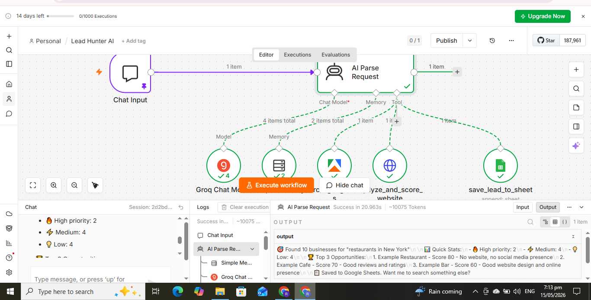

# LeadHunter AI 🎯

> A conversational AI agent that finds local businesses, analyzes their digital presence, and scores them as marketing opportunities — all from a single chat message.

**Built with:** n8n · Groq AI (Llama 3.3 70B) · Apify · Google Sheets



---

## What It Does

You type in chat:

```
Find 5 dentists in Lahore
```

LeadHunter AI then automatically:

1. 🧠 Understands your request (AI parses profession, location, count)
2. 🗺️ Scrapes Google Maps for matching businesses
3. 🌐 Visits each business's website
4. 🔍 Analyzes their digital presence (SSL, social media, contact info)
5. 📊 Scores each business 0–100 as a marketing opportunity
6. 📋 Saves everything to Google Sheets with priority labels
7. 💬 Replies with a summary of the best opportunities

**Time: ~60 seconds. Cost: ~$0.05 per 5 leads.**

---

## Why I Built This

Marketing agencies waste 4–6 hours every week manually researching prospects on Google Maps — searching, copying info, checking websites, noting who needs help, repeating dozens of times.

LeadHunter AI turns that into a 60-second chat message. And it doesn't just return a list — it returns a **prioritized** list, so agencies instantly know which businesses need their services most.

---

## The Opportunity Score

Every business gets a score from **0–100**. Higher score = more services needed = better lead.

| Signal Detected | Points |
| --- | --- |
| No website at all | +30 |
| Website has no SSL (http not https) | +15 |
| No Instagram link found | +10 |
| No Facebook link found | +10 |
| No LinkedIn link found | +5 |
| Fewer than 20 reviews | +10 |
| Rating below 4.0 stars | +10 |
| No public email found | +5 |

**Priority Labels:**

- 🔥 **High (60–100):** Major opportunity — needs multiple services
- ⚡ **Medium (35–59):** Some gaps — needs 1–2 services
- 💡 **Low (0–34):** Already well-optimized

---

## Architecture

This is built as an **AI agent with tools** — not a fixed pipeline. The AI decides which tools to call based on what the user asks. This makes it conversational and flexible.

```
[Chat Trigger]
      │
[AI Agent] ──── Brain: Groq Chat Model (Llama 3.3 70B)
      │     └─── Memory: Conversation buffer
      │
      ├──🔧 search_google_maps        (Apify - scrape Google Maps)
      ├──🔧 analyze_and_score_website (HTTP - fetch & analyze sites)
      └──🔧 save_lead_to_sheet        (Google Sheets - store leads)
```

Because it's an agent (not a script):

- It only acts when given a clear request
- It chains tools intelligently (search → analyze → save)
- The same agent could plug into other interfaces (WhatsApp, web widget, etc.)

---

## Tech Stack

| Tool | Role | Cost |
| --- | --- | --- |
| **n8n** (cloud) | Workflow automation & AI agent host | Free tier |
| **Groq (Llama 3.3 70B)** | The agent's reasoning brain | Free tier |
| **Apify** (Google Maps Scraper) | Reliable Google Maps data | ~$5 = 1000 leads |
| **Google Sheets** | Lead database | Free |

---

## Use Cases

The same core system can be adapted for:

- 🎨 **Web design agencies** → Find businesses with bad or no websites
- 📱 **Social media managers** → Find businesses with no social presence
- 📧 **Cold outreach teams** → Build pre-qualified lead lists
- ⭐ **Reputation managers** → Find low-rated businesses needing help
- 💬 **WhatsApp integration** → Text the agent and get leads back on your phone

---

## What's in This Repo

```
├── leadhunter-ai-workflow.json   # The n8n workflow (import this)
├── README.md                     # You're reading it
├── SETUP-GUIDE.md                # Step-by-step setup instructions
└── demo.png                      # Demo screenshot
```

---

## Setup

### Prerequisites

- n8n account (cloud or self-hosted)
- Apify account (free tier works) — [apify.com](https://apify.com)
- Groq API key (free) — [console.groq.com](https://console.groq.com)
- Google account (for Sheets)

### Quick Start

1. **Get your API keys**
   - Apify: Settings → API tokens → Create token
   - Groq: Create API key
   - Google Sheets: Create a sheet, copy its ID from the URL

2. **Prepare the Google Sheet**

   Add these column headers in row 1:

   ```
   Business Name | Phone | Email | Website | Address | Rating |
   Reviews | Opportunity Score | Priority | Opportunities | Date Added
   ```

3. **Import the workflow**
   - In n8n: Workflows → Import from file → select `leadhunter-ai-workflow.json`

4. **Configure credentials**
   - Connect your Apify account to the `search_google_maps` tool
   - Connect Groq to the Chat Model node
   - Connect Google Sheets to the `save_lead_to_sheet` tool
   - Paste your Sheet ID where indicated

5. **Test**
   - Activate the workflow
   - Open chat
   - Type: `Find 3 dentists in Lahore`
   - Check your Google Sheet for results

Full step-by-step instructions in [SETUP-GUIDE.md](SETUP-GUIDE.md).

---

## Honest Notes & Limitations

**What it does well:**

- Finds local businesses fast
- Identifies real marketing opportunities
- Builds prioritized lead lists
- Conversational, flexible interface

**Current limitations:**

- Email extraction works ~40–60% of the time (many sites hide emails)
- Groq free tier has rate limits — best with small batches (3–10 leads per search)
- Some websites block automated visits (handled gracefully — business still saved)
- Default capped at 10 results per search for speed and cost control

**Built for:** demos, lead generation for small-to-mid agencies, portfolio.
**Not built for:** enterprise-scale scraping of 10,000+ leads/day.

---

## Roadmap

- [x] Conversational AI agent
- [x] Google Maps scraping (Apify)
- [x] Website analysis + opportunity scoring
- [x] Google Sheets export
- [ ] WhatsApp integration (Twilio)
- [ ] Email verification (Hunter.io)
- [ ] AI-generated cold email drafts per lead
- [ ] Pagination ("show me more" continues from last search)
- [ ] CRM integrations (HubSpot, Pipedrive)

---

## About the Author

**Usman Rai** — Self-taught automation & AI developer

Building automation systems that save businesses hours of manual work. This is one of several projects in my portfolio.

📧 raiusmanr517@gmail.com
🔗 [LinkedIn](https://linkedin.com/in/usman-rai)
🐙 [GitHub](https://github.com/Usman-rai)

Open to freelance automation projects. If you want this customized for your agency's tools and workflow, reach out.

---

## License

MIT — Free for personal and commercial use. Attribution appreciated.

---

⭐ If this saved you hours of manual prospecting, consider giving it a star.

